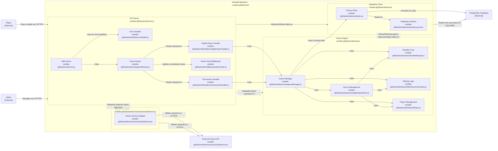

# Diagrama de la APP

```mermaid

flowchart LR
 subgraph apiServer["API Server<br>roulette-git/backend/server.js"]
        webServer["Web Server<br>roulette-git/backend/server.js"]
        router["Game Router<br>roulette-git/backend/routes/gameRoutes.js"]
        singlePlayerHandler["Single Player Handler<br>roulette-git/backend/handlers/singlePlayerHandler.js"]
        tournamentHandler["Tournament Handler<br>roulette-git/backend/handlers/tournamentHandler.js"]
        adminAuthMiddleware["Admin Auth Middleware<br>roulette-git/backend/middleware/adminAuth.js"]
        errorHandler["Error Handler<br>roulette-git/backend/utils/errorHandler.js"]
  end
 subgraph gameEngine["Game Engine<br>roulette-git/backend/classes"]
        gameManager["Game Manager<br>roulette-git/backend/services/gameManager.js"]
        rouletteCore["Roulette Core<br>roulette-git/backend/classes/RouletteEngine.js"]
        bettingLogic["Betting Logic<br>roulette-git/backend/classes/BetPayoutCalculator.js"]
        playerManagement["Player Management<br>roulette-git/backend/classes/Player.js"]
        roomManagement["Room Management<br>roulette-git/backend/classes/SinglePlayerRoom.js"]
  end
 subgraph databaseClient["Database Client<br>roulette-git/backend/prisma"]
        prismaClient["Prisma Client<br>roulette-git/backend/prisma/index.js"]
        databaseSchema["Database Schema<br>roulette-git/backend/prisma/schema.prisma"]
  end
 subgraph casinoApiClient["Casino API Client<br>roulette-git/backend/services/casinoApiService.js"]
        casinoServiceAdapter["Casino Service Adapter<br>roulette-git/backend/services/casinoApiService.js"]
  end
 subgraph rouletteBackend["Roulette Backend<br>roulette-git/backend"]
        apiServer
        gameEngine
        databaseClient
        casinoApiClient
  end
    webServer -- Uses --> router
    webServer -- Uses for error handling --> errorHandler
    router -- Routes requests to --> singlePlayerHandler & tournamentHandler
    router -- Applies to protected routes --> adminAuthMiddleware
    gameManager -- Uses --> rouletteCore & bettingLogic & playerManagement & roomManagement
    roomManagement -- Uses --> rouletteCore & bettingLogic & playerManagement
    prismaClient -- Based on --> databaseSchema
    apiServer -- Delegates game operations to --> gameEngine
    apiServer -- Retrieves/Stores data via --> databaseClient
    apiServer -- Requests external casino data from --> casinoApiClient
    gameEngine -- Stores/Retrieves game state and player data via --> databaseClient
    singlePlayerHandler -- Uses --> gameManager
    tournamentHandler -- Uses --> gameManager
    gameManager -- Uses to persist data --> prismaClient
    player["Player<br>[External]"] -- Plays roulette via | HTTP/S --> apiServer
    admin["Admin<br>[External]"] -- Manages via | HTTP/S --> apiServer
    databaseClient -- Reads from and writes to | SQL/ORM --> database["PostgreSQL Database<br>[External]"]
    casinoApiClient -- Makes requests to | HTTP/S --> casinoApi["External Casino API<br>roulette-git/backend/services/casinoApiService.js"]
    casinoServiceAdapter -- Makes requests to | HTTP/S --> casinoApi
    prismaClient -- Connects to | SQL --> database
```
