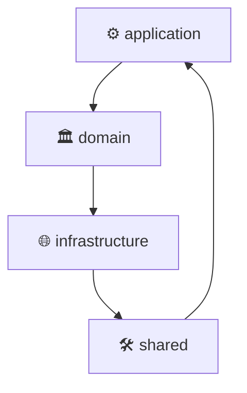

# 🎰 roulette-back v1.0.0

[]()
[]()
[]()
[]()

🎲 Backend estructurado con Clean Architecture para Ruleta y Torneos de Casino. Soporta API REST, comunicación WS y persistencia con Prisma ORM.

---

## 🚀 Scripts disponibles

- 📝 `dev`: nodemon
- 📝 `start`: node src/server.js
- 📝 `lint`: eslint .
- 📝 `test`: node --experimental-vm-modules node_modules/jest/bin/jest.js
- 📝 `migrate`: npx prisma migrate deploy
- 📝 `add:comments`: node add-file-comments.js
- 📝 `format`: prettier --write .

---

## 📦 Dependencias principales

- **Runtime**:
  - 📌 @prisma/client ^6.16.0
  - 📌 axios ^1.12.1
  - 📌 date-fns ^4.1.0
  - 📌 date-fns-tz ^3.2.0
  - 📌 dotenv ^17.2.2
  - 📌 express ^4.19.2
  - 📌 opossum ^9.0.0
  - 📌 prisma ^6.16.0
  - 📌 socket.io ^4.7.5
  - 📌 uuid ^11.1.0

- **Dev**:
  - 🛠 @eslint/js ^9.33.0
  - 🛠 @jest/globals ^30.1.2
  - 🛠 @types/express ^4.17.21
  - 🛠 @types/node ^20.14.9
  - 🛠 @types/socket.io ^3.0.2
  - 🛠 eslint ^9.33.0
  - 🛠 eslint-plugin-node ^11.1.0
  - 🛠 globals ^16.3.0
  - 🛠 jest ^30.1.3
  - 🛠 nodemon ^3.1.4
  - 🛠 prettier ^3.6.2

---

## 🏗️ Estructura del proyecto

```
├── 📂 application
│   └── 📂 managers
│       ├── 📄 gameManager.js
│       └── 📄 index.js
├── 📂 domain
│   ├── 📂 entities
│   │   ├── 📄 Player.js
│   │   ├── 📄 RouletteEngine.js
│   │   ├── 📄 SinglePlayerRoom.js
│   │   └── 📄 TournamentRoom.js
│   └── 📂 value-objects
│       ├── 📄 BetLimits.js
│       ├── 📄 BetPayoutCalculator.js
│       └── 📄 BetValidator.js
├── 📂 infrastructure
│   ├── 📂 api
│   │   └── 📄 casinoApiService.js
│   ├── 📂 http
│   │   ├── 📂 middleware
│   │   │   └── 📄 adminAuth.js
│   │   └── 📂 routes
│   │       └── 📄 gameRoutes.js
│   └── 📂 ws
│       ├── 📄 singlePlayerHandler.js
│       └── 📄 tournamentHandler.js
├── 📄 server.js
└── 📂 shared
    ├── 📄 errorHandler.js
    ├── 📄 errorMessages.js
    └── 📄 timezone.js
```



---

## 📡 Endpoints HTTP

- 🌍 `GET /status`
- 🌍 `GET /peek/:roomId`
- 🌍 `DELETE /:roomId`
- 🌍 `GET /rounds`
- 🌍 `POST /auth/validate-token`
- 🌍 `POST /tournament/create`

---

## 🎧 Handlers WS

🎧 singlePlayerHandler
🎧 tournamentHandler

---

## ▶️ Cómo correr el proyecto

1. 📦 Instalar dependencias:

   ```bash
   npm install
   ```

2. 🚀 Correr en desarrollo:

   ```bash
   npm run dev
   ```

3. 🧪 Ejecutar pruebas:

   ```bash
   npm test
   ```

---

## 📖 Notas

- 🗄 **ORM**: Prisma
- 🏗 **Arquitectura**: Clean Architecture
- 📜 **Logs**: consola (se puede extender a Winston o Pino)

---

## 👤 Autor

<table>
  <tr>
    <td align="center">
      <a href="https://maxcereceda.com/">
        
        <br />
        <sub><b>Max Cereceda</b></sub>
      </a>
      <br />
      🌐 <a href="https://maxcereceda.com/">maxcereceda.com</a><br />
      🐙 <a href="https://github.com/maxcerecedadev">GitHub</a>
    </td>
  </tr>
</table>
